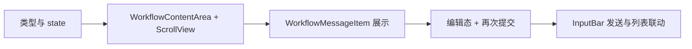

# 工作流内容区：可滑动聊天区 + 可编辑/二次提交

## 目标

- **内容区**：像聊天软件一样可滑动，消息按时间顺序从上到下排列，新内容在底部。
- **可修改与二次提交**：某条内容（尤其是用户消息）支持编辑后再次提交（追加为新消息或替换原条并从此处“重跑”，由你后续与后端约定）。

## 1. 数据模型（建议先落在前端）

在 [constants/type.ts](constants/type.ts) 中扩展或新增「工作流消息」类型，用于内容区列表与编辑/二次提交：

```ts
// 单条消息/输出
export type WorkflowMessageRole = 'user' | 'assistant' | 'system';

export interface WorkflowMessage {
  id: string;
  role: WorkflowMessageRole;
  content: string;
  createdAt: number;           // 用于排序与展示时间
  isEditable?: boolean;       // 是否允许编辑（通常仅 user）
  status?: 'pending' | 'done' | 'error';  // 可选：流式/异步状态
}
```

- 列表即 `WorkflowMessage[]`，按 `createdAt` 或插入顺序渲染，新消息 push 到末尾即可保证「按顺序输出」。
- 编辑与二次提交只对 `role === 'user'` 且 `isEditable === true` 的项开放（若需要也可对 assistant 做只读展示+复制）。

## 2. 整体布局与滚动

当前 [app/(main)/workflow.tsx](app/(main)/workflow.tsx) 结构是：外层 `View` → `TouchableWithoutFeedback` → 内层 `View (flex:1, justifyContent:'flex-end')` → 注释掉的「内容区」→ 快捷操作 → 输入条。

建议调整为：

- **内容区**：占据除底部「快捷操作 + 输入条」以外的全部空间，且**自己可滚动**（不依赖整页滚动），这样键盘弹起时仍可保持「输入条贴键盘、内容区在上方可滚动」的聊天体验。
- 实现方式二选一：
  - **ScrollView**：实现简单，适合消息量不大或先做 MVP。
  - **FlatList**：消息很多时更合适，可 `inverted` 或正常顺序 + `scrollToEnd`；若采用 `inverted`，数据需反序或插入用 `unshift`。

推荐先使用 **ScrollView + 正常顺序**（新消息 append，`scrollToEnd` 或 `ref.scrollTo({ y })`），与「按顺序输出」一致，后续若消息量上来再改为 FlatList。

布局要点：

- 内容区：`flex: 1`，`ScrollView` 填满，`contentContainerStyle` 底部留一点 padding，避免最后一条被快捷操作挡住。
- 快捷操作 + 输入条：不放在 ScrollView 内，保持现有固定底部结构；键盘逻辑（`keyboardHeight`、`setPagerScrollEnabled`）**不改动**，继续在 `workflow.tsx` 中维护。

这样「内容区可滑动」与「按顺序输出」都能满足。

## 3. 新组件拆分（在 components/workflow 下）


| 组件                            | 职责                                                                                                    |
| ----------------------------- | ----------------------------------------------------------------------------------------------------- |
| **WorkflowContentArea**       | 占满内容区高度，内包一个 ScrollView（或后续 FlatList），接收 `messages: WorkflowMessage[]`、`onScrollToEnd` 等，负责列表渲染与滚动到底。 |
| **WorkflowMessageItem**       | 单条消息展示：根据 `role` 区分样式（用户靠右/系统或 AI 靠左，或统一左对齐+角色标签）。展示 `content`、可选时间戳、状态。                              |
| **WorkflowMessageBubble**（可选） | 若希望气泡样式统一，可从 MessageItem 中拆出纯展示气泡（文案 + 背景 + 圆角），MessageItem 负责布局（左/右）与操作按钮。                           |


编辑与二次提交入口放在 **WorkflowMessageItem** 上：

- 仅当 `role === 'user'` 且可编辑时，展示「编辑」按钮（或长按菜单）。
- 点击编辑：进入「行内编辑态」—— 如将当前气泡替换为 `TextInput` +「取消」「再次提交」按钮；或使用 Modal/底部抽屉编辑，依你 UI 偏好。
- 「再次提交」行为二选一（建议先实现一种，后续可配置）：
  - **方案 A**：用编辑后的文案作为**新的一条 user 消息** append 到列表末尾（不删原条，相当于“基于这条再发一条”）。
  - **方案 B**：**替换**当前条 content，并触发「从该条重新执行」的回调（如 `onResubmitFrom(messageId)`），由上层/后续后端决定是否从该步重跑工作流。

数据流建议：`workflow.tsx` 持有 `messages` state 和 `setMessages`，内容区只负责展示和触发回调；编辑/二次提交的回调（如 `onEditMessage(id, newContent)`、`onResubmit(id)`）在 `workflow.tsx` 里更新 `messages` 或调用后续接口。

## 4. 与现有页面的衔接

- **[workflow.tsx](app/(main)/workflow.tsx)**  
  - 新增 state：`messages: WorkflowMessage[]`（可初始为 `[]` 或带一条欢迎占位）。  
  - 在「内容区」注释处渲染 `<WorkflowContentArea messages={messages} onEditAndResubmit={...} />`。  
  - 输入条提交时：将当前 `inputText` 推成一条新 `user` 消息并 `setMessages`，清空输入框；若有 ScrollView ref，则 `scrollToEnd`。  
  - 不改变现有键盘监听、`inputBarMarginBottom`、快捷操作与输入条组件。
- **WorkflowInputBar**  
  - 当前没有「发送」逻辑。需要增加一个发送入口（例如发送按钮或键盘确认），并对外提供 `onSubmit: (text: string) => void`，由 `workflow.tsx` 里把 text 当作新 user 消息 append 并滚动到底。

## 5. 实现顺序建议




1. **类型与 state**：在 `type.ts` 中定义 `WorkflowMessage`；在 `workflow.tsx` 中增加 `messages` state。
2. **内容区与滚动**：实现 `WorkflowContentArea`（ScrollView + 占满高度），接收 `messages`，内部 map 渲染占位或简单文本。
3. **单条展示**：实现 `WorkflowMessageItem`（含左右布局/气泡样式），替换 content 区占位。
4. **编辑与二次提交**：在 MessageItem 上增加编辑入口与行内编辑态，在 `workflow.tsx` 中实现 `onEditMessage` / `onResubmitFrom` 更新列表（先采用方案 A 或 B 其一）。
5. **发送联动**：为 `WorkflowInputBar` 增加 `onSubmit`，在 `workflow.tsx` 中把输入内容 push 为 user 消息并滚动到底。

按上述顺序可实现：内容区像聊天一样可滑动、按顺序输出，且支持对已有内容编辑后再次提交；后续若要接后端，只需把「提交」和「从某条重跑」换成 API 调用即可。

## 6. 需要你确认的一点

「二次提交」你更倾向哪种行为？

- **A**：编辑后作为**新的一条消息**追加到末尾（不删原条，实现简单）。  
- **B**：**替换**原条内容，并触发「从该条重新执行」工作流（需后续与后端/引擎约定「从某 messageId 重跑」）。

确认后可按该行为在计划里固定 onResubmit 的语义，实现时就不会歧义。